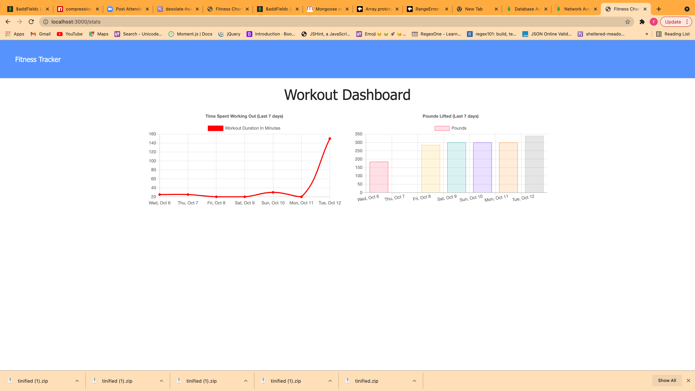
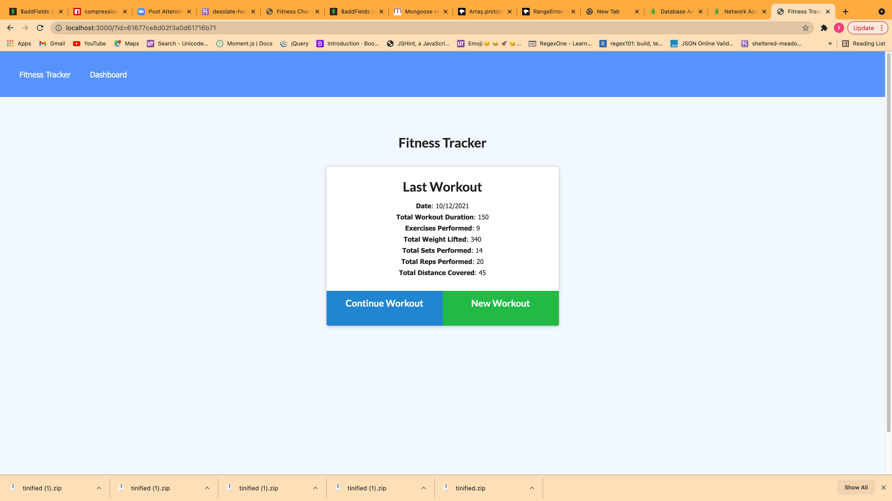

# fitness-tracker

## Description
```
A consumer will reach their fitness goals more quickly when they track their workout progress. In my application, user will be able to view create and track daily workouts. user will be able to log multiple exercises in a workout on a given day. user should also be able to track the name, type, weight, sets, reps, and duration of exercise. If the exercise is a cardio exercise, user should be able to track my distance traveled.
```

## Outcome Image




## Repo
[Github](https://github.com/yinping-520/fitness-tracker)

[Heroku link](https://desolate-headland-39660.herokuapp.com/)